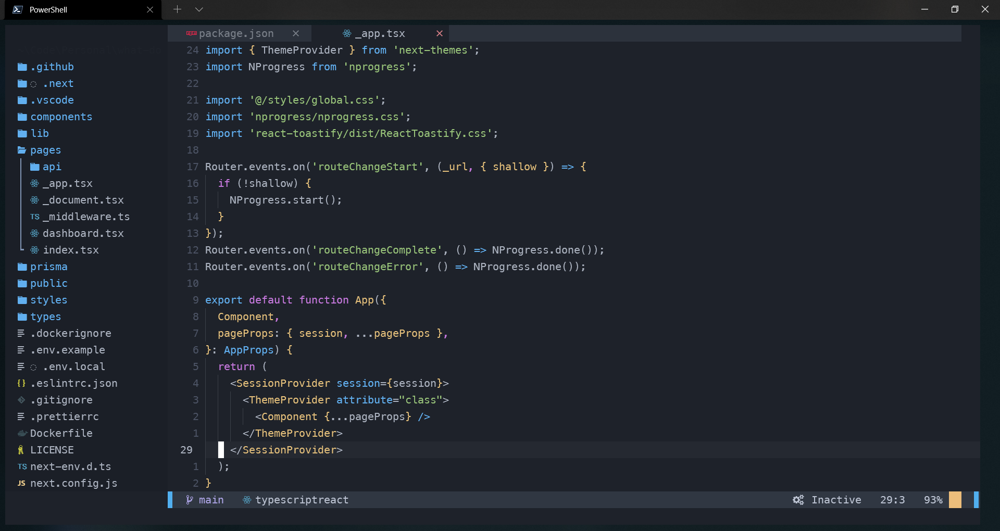

# My dotfiles

### Programms

- [Visual Studio Code](https://code.visualstudio.com/) - Code editor
- [Visual Studio](https://visualstudio.microsoft.com/de/) - IDE
- [Windows Terminal](https://github.com/microsoft/terminal)
- [Postman](https://www.postman.com/) - HTTP Client
- [DevToys](https://devtoys.app/) - Developer Tools
- [SQL Server Management Studio](https://docs.microsoft.com/de-de/sql/ssms/download-sql-server-management-studio-ssms?view=sql-server-ver15) - Database management tool

### PowerShell Tools and Clis

> [Inspired by devaslife](https://www.youtube.com/watch?v=5-aK2_WwrmM)

- [Scoop](https://scoop.sh/) - A command-line installer
- [Git for Windows](https://gitforwindows.org/)
- [Oh My Posh](https://ohmyposh.dev/) - Prompt theme engine
- [Terminal Icons](https://github.com/devblackops/Terminal-Icons) - Folder and file icons
- [PSReadLine](https://docs.microsoft.com/en-us/powershell/module/psreadline/) - Cmdlets for customizing the editing environment, used for autocompletion
- [z](https://www.powershellgallery.com/packages/z) - Directory jumper
- Npm ([Installed npm packages](https://github.com/Alex289/My-config-setup/blob/master/Npm-Packages.md))

### Neovim setup

- [AstroVim](https://github.com/kabinspace/AstroVim) - A neovim config
- I added a configuration to feline to show the current vim mode (See `nvim/lua/user/plugins/feline.lua`)

### Browser Extensions

- Wappalyzer
- React Dev Tools
- 1Password
- AdBlocker
