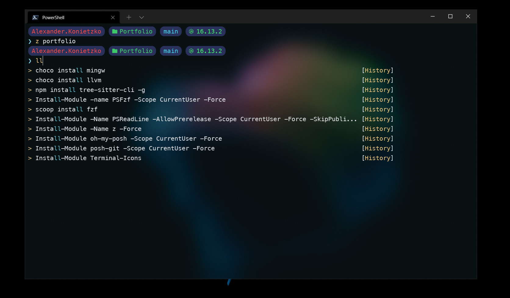
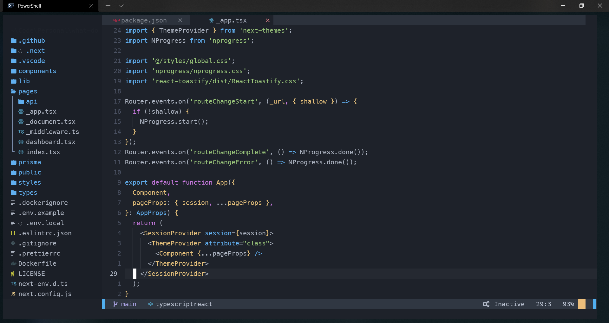

# My dotfiles

### Programms

- [Visual Studio Code](https://code.visualstudio.com/) - Code editor
- [DevToys](https://devtoys.app/) - Developer Tools
- [Docker](https://www.docker.com/) - Containerization

### Command line tools

- bat - Better cat command
- npm ([Installed npm packages](https://github.com/Alex289/My-config-setup/blob/master/Npm-Packages.md))

### Neovim setup

- [AstroVim](https://github.com/AstroNvim/AstroNvim) - A neovim config
- I added a configuration to to show the current vim mode (See my config [here](https://github.com/alex289/astronvim_config))

### Browser Extensions

- 1Password
- AdBlocker
- Material Icons for GitHub
- Refined GitHub
